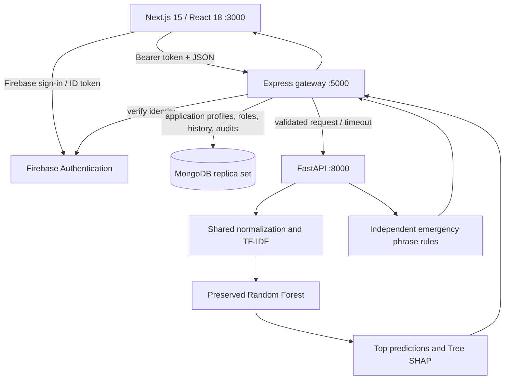

# MediXAI

**Explainable AI-Based Symptom Analysis and Emergency Risk Prediction for Intelligent Healthcare Decision Support**

MediXAI is a working **local academic prototype**. The existing Next.js interface
now connects through Express to FastAPI for English/Bangla symptom normalization,
real model predictions, SHAP feature contributions and independent emergency
phrase checks. The original branding, pages, components and trained model remain.

> MediXAI provides AI-assisted health insights for decision support. Predictions
> are not confirmed medical diagnoses. Always consult a qualified healthcare
> professional for medical advice. In an emergency, seek immediate professional
> medical assistance.

**Model limitation:** the preserved 30-class Random Forest has test accuracy
**0.0342** and macro F1 **0.034214**, near chance. Its probabilities are uncalibrated
model scores, not medical probabilities. This application demonstrates integration
and explainability; it cannot reliably identify conditions or rule out emergencies.
See the verified [evaluation evidence](reports/phase2_evaluation.json).

Analysis results now include individual predictions from Naive Bayes, Logistic
Regression, SVM and Random Forest, plus a final equal-weight voting result.
Each model casts one vote. Ties are shown explicitly and resolved by alphabetical
condition name. Vote counts are not probabilities; SVM has no probability score.
The website and printable report show all four results. Existing `prediction`,
top scores and SHAP fields still describe the selected best model, while
`modelPredictions` and `finalPrediction` contain the comparison and combined result.
The four-model ensemble has not been separately evaluated for accuracy.

## Architecture



The browser calls **Express only** for application APIs. Firebase Authentication
manages identity and credentials; Express verifies Firebase ID tokens and reads
authoritative `USER` / `ADMIN` roles and application data from MongoDB. Python
loads trusted local artifacts once at startup. The ML pipeline remains unchanged.
Services bind to loopback by default. `GET /api/health` checks the gateway and ML
service; protected account and dashboard features also require configured Firebase
and a MongoDB replica set. See [account platform setup](docs/ACCOUNT_SETUP.md).

## Features

- Deterministic English/Bangla phrases, shared training/inference feature encoding.
- Genuine top-three model probabilities, explicit unknown-input handling.
- SHAP contributions with positive/negative bars and model-versus-clinical explanation wording.
- Independent `HIGH` / `CRITICAL` phrase flags; `UNASSESSED` when no rule matches.
  No invented emergency probability or numeric weights. Urgent guidance survives
  model errors and is displayed above the prediction.
- Real request loading, cancellation, validation, timeouts and partial SHAP failure.
- Responsive cards, keyboard/focus handling, reduced motion, English/Bangla UI,
  and light/dark themes with system defaults and locally saved preferences.
- Signed-in users can explicitly consent to store completed analyses in their
  private MongoDB history, review and delete their own records, and prepare
  browser-generated PDF reports. Temporary page state is not persisted in browser
  storage. Report preparation does not claim that a PDF was downloaded.
- Firebase email/password account flows, password reset, protected user/admin
  workspaces, server-side role checks and an audited command-line admin bootstrap.
- General educational information links to NHS and MedlinePlus. Condition-specific
  summaries honestly remain unavailable until reviewed content exists.
- Responsive research UI, clearly labeled interactive preview, optional individual
  symptom search, and locally served Inter/Sora/Noto Sans Bengali fonts.
- `/transparency`, `/performance`, `/privacy`, and `/disclaimer` explain the methods,
  actual evaluation metrics, model limitations and data handling in both languages.
- The performance page uses evaluation evidence bound to the loaded artifact hashes.
  It includes the real confusion matrix and derived per-class scores.
- English browser speech input requires review before analysis. No audio is stored
  by MediXAI; the browser speech provider may process audio remotely.
- Download Analysis Report opens the browser print dialog; choose **Save as PDF**.
  Both languages use the actual result, with model limitations and a non-diagnostic title.

## Setup

Requirements: Python **3.10+** (tested with **3.13**), Node **22.9+** (tested with
**24.11.0**), npm. Older Python versions may resolve older compatible scientific
packages; retrain artifacts in that environment rather than loading incompatible
scikit-learn pickle files. Only load artifact files you trust.

From the repository root, in PowerShell:

```powershell
python -m venv .venv
.\.venv\Scripts\python.exe -m pip install -r ml/requirements.txt
cd backend/express
npm ci
Copy-Item .env.example .env
cd ../../frontend
npm ci
Copy-Item .env.example .env.local
cd ..
```

The scientific/service package versions actually exercised are recorded in
`ml/requirements-tested.txt`; use that file instead for a matching Python 3.13
environment. On Unix, substitute `.venv/bin/python` and `cp` for the PowerShell
commands. Existing environments do not need to be recreated.

### Dataset and artifacts

The existing local `ml/data/Healthcare.csv` contains 25,000 rows and 30 classes.
CSV datasets and binary models are ignored by Git, so a fresh checkout needs the
dataset and training, or a trusted compatible artifact bundle. Dataset resolution
is documented in [ml/data/README.md](ml/data/README.md). Set `MEDIXAI_DATASET` for
an explicit dataset; do not use synthetic demonstration data as clinical evidence.

If the saved model, vectorizer and label encoder already exist, package their
metadata and training-only SHAP background **without retraining**:

```powershell
cd ml
..\.venv\Scripts\python.exe -m src.artifacts
cd ..
```

To train and evaluate all four models when artifacts are missing:

```powershell
cd ml
..\.venv\Scripts\python.exe -m src.train
..\.venv\Scripts\python.exe -m src.evaluate
..\.venv\Scripts\python.exe -m src.predict "fever, cough, headache, fatigue"
..\.venv\Scripts\python.exe -m src.predict "জ্বর, কাশি, মাথা ব্যথা"
cd ..
```

`evaluate` selects by macro F1, then macro recall, and writes compatible metadata
and SHAP background. Keep `MEDIXAI_DATASET` consistent for both commands. For
bigrams, pair `src.train --ngrams 1-2` with `src.evaluate --on bigram`.
`src.eda` and the existing exploration notebook remain available.

### Start the application services

Configure Firebase and MongoDB as described in [account platform setup](docs/ACCOUNT_SETUP.md).
MongoDB must be an Atlas deployment or local replica set; standalone MongoDB is
not supported because analysis records and audit entries are committed together.
Copy and fill `backend/express/.env.example` and `frontend/.env.example` before
starting account features. Missing platform configuration keeps protected routes
closed; it does not disable the public research pages.

Terminal 1, repository root (FastAPI):

```powershell
.\.venv\Scripts\python.exe -m uvicorn main:app --app-dir backend/ml-service --host 127.0.0.1 --port 8000 --no-access-log
```

Terminal 2 (Express; loads `backend/express/.env`):

```powershell
cd backend/express
npm ci
npm run dev
```

Terminal 3 (Next.js; loads `frontend/.env.local`):

```powershell
cd frontend
npm ci
npm run dev
```

Open **http://localhost:3000**. Express is at
http://localhost:5000; FastAPI is at http://127.0.0.1:8000. The default CORS origin
is exactly `http://localhost:3000`; using `127.0.0.1` in the browser requires a
matching `CORS_ORIGIN` setting. For a production-mode local build use
`npm run build`, then `npm start` in `frontend`.

## Environment variables

| Variable | Service | Default / use |
|---|---|---|
| `NEXT_PUBLIC_API_URL` | Next.js | `http://localhost:5000`; public Express URL only; rebuild after changes |
| `ML_SERVICE_URL` | Express | Required; example `http://127.0.0.1:8000` |
| `HOST`, `PORT` | Express | `127.0.0.1`, `5000` |
| `CORS_ORIGIN` | Express | Comma-separated exact browser origins; local default: `http://localhost:3000,http://127.0.0.1:3000` |
| `ML_TIMEOUT_MS` | Express | `20000`; frontend timeout is 25000 ms |
| `ML_MODEL_DIR` | FastAPI | Repository `ml/models` when unset/empty |
| `MEDIXAI_DATASET` | Training/packaging | Explicit CSV path; otherwise dataset discovery |
| `MONGODB_URI`, `MONGODB_DB_NAME` | Express | Private replica-set connection and database; required for authenticated platform APIs |
| `FIREBASE_PROJECT_ID` | Express | Firebase project used to verify ID tokens |
| `FIREBASE_CLIENT_EMAIL`, `FIREBASE_PRIVATE_KEY` | Express | Optional service-account credential pair; otherwise use Application Default Credentials |
| `GOOGLE_APPLICATION_CREDENTIALS` | Express | Optional path to protected Admin SDK credentials outside the repository |
| `NEXT_PUBLIC_FIREBASE_API_KEY`, `NEXT_PUBLIC_FIREBASE_AUTH_DOMAIN`, `NEXT_PUBLIC_FIREBASE_PROJECT_ID`, `NEXT_PUBLIC_FIREBASE_STORAGE_BUCKET`, `NEXT_PUBLIC_FIREBASE_MESSAGING_SENDER_ID`, `NEXT_PUBLIC_FIREBASE_APP_ID` | Next.js | `medixai-bd` Firebase Web app configuration; public client identifiers, not Admin credentials |
| `NEXT_PUBLIC_FIREBASE_GOOGLE_ENABLED` | Next.js | `false` by default; enable only after configuring the Google provider in Firebase |
| `E2E_BROWSER_CHANNEL` | Browser tests | `msedge`; use `chromium` with Playwright Chromium installed |
| `E2E_BASE_URL` | Browser tests | `http://localhost:3000` |
| `MEDIXAI_GATEWAY_URL` | Integration smoke | `http://127.0.0.1:5000` |

The root `.env.example` is a reference containing the shared defaults and public
Firebase configuration; it is not loaded automatically by any service. Copy the
frontend template to `frontend/.env.local`, Express template to
`backend/express/.env`, and ML template to `backend/ml-service/.env`. Express loads
its own `.env`; Next loads `.env` and gives `.env.local` higher priority. FastAPI
automatically loads `backend/ml-service/.env`, regardless of the working directory,
without overriding existing process environment variables. Set `ML_MODEL_DIR` there
to an absolute directory, or leave it empty to use the repository's `ml/models`.
Do not put server credentials in `NEXT_PUBLIC_*`; local environment files are
Git-ignored. Do not commit Firebase Admin credentials or service-account files.

## API

| Service | Method | Endpoint |
|---|---|---|
| Express | GET | `/api/health`, `/api/model-info` |
| Express | POST | `/api/analyze` |
| Express | GET/POST | `/api/auth/me`, `/api/auth/session`; authenticated logout at `/api/auth/logout` |
| Express | GET/PATCH | `/api/users/me`, `/api/users/me/profile`, `/api/users/me/settings` |
| Express | GET/POST/DELETE | `/api/analyses`, `/api/analyses/:id` (authenticated owner only) |
| Express | GET/POST | `/api/reports`, `/api/reports/:id` (authenticated owner only) |
| Express | GET/PATCH/PUT | `/api/admin/*` (MongoDB role `ADMIN` required) |
| FastAPI | GET | `/health`, `/model-info` |
| FastAPI | POST | `/predict`, `/explain`, `/risk`, `/analyze` |

Request: `{"symptoms":"fever, cough, headache, fatigue","language":"en"}`.
Use `bn` for Bangla. Maximum 2,000 characters and 16 KiB JSON body. Extra input
fields, invalid languages, control characters and non-text input are rejected.

`/analyze` returns `success`, `requestId`, `input`, `normalizedSymptoms`,
`unrecognizedSymptoms`, `prediction` (with alternatives), `predictions`, `model`,
`explanation`, `risk`, `education`, and `disclaimer`.
SHAP failure returns a genuine prediction with `explanation.available=false`.
Unknown/negated input returns 422; missing model returns 503. Both preserve the
independent risk result when available. Risk failure returns `UNAVAILABLE`, never
low risk. Malformed JSON is 400, oversized body 413, wrong content type 415,
upstream invalid schema 502, and gateway timeout 504.

The gateway validates and allowlists response fields. It does not forward Python
exceptions, arbitrary upstream errors, artifact paths or service configuration.
Logs contain request IDs, known endpoint names, timing, status and model version
when available; they omit symptom text. API responses use `Cache-Control: no-store`.
Authenticated analyses are stored with the consenting user's verified Firebase
UID and an audit entry; failed inference is not saved. User histories, detail,
deletion and report access are owner-scoped, including for administrators. Admin
analysis monitoring omits raw symptoms and user IDs. Audit records intentionally
contain minimal actor/action metadata and survive deletion of an analysis.

## Tests and reports

```powershell
# Repository root
.\.venv\Scripts\python.exe -m pytest -q
.\.venv\Scripts\python.exe backend/integration_smoke.py

cd backend/express
npm test
cd ../../frontend
npm run build
npm run test:e2e
```

The Express suite uses an isolated MongoDB in-memory replica set and Firebase
verification doubles; it does not prove connectivity to a live Firebase project
or deployed database. See [account setup](docs/ACCOUNT_SETUP.md) for secure
first-admin creation and the exact platform API contract. The integration smoke
checks FastAPI's real model and Express's unauthenticated rejection; to exercise
the authenticated gateway and persistence too, export `NEXT_PUBLIC_FIREBASE_API_KEY`
along with the dedicated test-account credentials.

After `npm run build`, run the complete browser checks from the repository root with
`.\.venv\Scripts\python.exe backend/run_e2e.py`. This supervisor starts missing local
services, runs the integration smoke test and Playwright, and stops only processes
it started. Existing healthy services are reused. It saves service logs without
symptom text under the ignored `.runtime/` directory.

The standalone smoke and browser commands require all three local services running.
Authenticated browser scenarios additionally require the Firebase/MongoDB setup
and a dedicated disposable account; export `E2E_TEST_EMAIL` and
`E2E_TEST_PASSWORD` for that account before running them. Those scenarios are
skipped when the test credentials are absent. Browser tests use headless Microsoft
Edge by default. To use bundled Chromium:
`npx playwright install chromium`, then set `$env:E2E_BROWSER_CHANNEL='chromium'`.
Unit tests use an isolated synthetic fixture; they do not replace real artifacts.
The browser tests use actual model responses except for explicitly simulated
failure cases. Screenshots are saved under `reports/figures/phase2-*`.

Read-only reproduction of all saved models' real-dataset metrics:

```powershell
cd ml
..\.venv\Scripts\python.exe -m src.verify
```

Results are available in [evaluation JSON](reports/phase2_evaluation.json) and on
the Model Performance page, which displays only evaluation evidence that matches
the loaded artifact bundle.

## Troubleshooting

| Problem | Fix |
|---|---|
| Model missing / `/health` reports `modelLoaded:false` | Restore the three legacy joblib files plus matching metadata/background, or run `src.train` then `src.evaluate`; restart FastAPI. |
| Artifact hash / feature mismatch | Do not mix model versions. Package a consistent bundle with `src.artifacts`; if packaging rejects it, retrain and evaluate on the same dataset. |
| FastAPI unavailable | Start Terminal 1; check `http://127.0.0.1:8000/health`. Check the active virtual environment. |
| Express cannot connect | Copy its `.env.example`, set `ML_SERVICE_URL`, start FastAPI, restart Express, then check `/api/health`. |
| CORS error | Add the browser origin to `CORS_ORIGIN`, comma-separated if needed, then restart Express. `localhost` and `127.0.0.1` are distinct origins. |
| Wrong frontend API URL | Set `NEXT_PUBLIC_API_URL` in `frontend/.env.local`; restart dev or rebuild production. It must point to Express, not Python. |
| SHAP unavailable | Install `ml/requirements.txt` in the same Python environment; run `src.artifacts` if background is missing; check compatible NumPy/Numba/SHAP versions; restart FastAPI. |
| Python package / binary error | Use an isolated supported Python environment; for the tested Python 3.13 bundle install `ml/requirements-tested.txt`. Retrain after changing scikit-learn versions. |
| Dataset missing | Put the CSV in `ml/data/Healthcare.csv` or set `MEDIXAI_DATASET`; never substitute demo metrics silently. |
| No recognized symptoms | Try comma-separated phrases in the training vocabulary. Enter only current positive symptoms. Emergency flags can still be returned. |
| Font unavailable | Fonts are served from `frontend/public/fonts`; verify those assets are included. System-font fallbacks remain available. |
| Browser executable missing | Install Edge, or install Playwright Chromium and select its channel as above. |

## Limitations and deployment boundary

- No clinical validation, calibration, vital signs, demographic reasoning or
  comprehensive language/negation understanding. Disease labels can be misleading
  even with a seemingly large model probability.
- Rule categories are implementation priorities, not clinical triage thresholds.
  Rules flag mentions even when negated or historical. Missing matches mean
  **unassessed**, never a rule-out. Bangla coverage is limited.
- SHAP describes the model, not medical causality; omitted/absent input features
  can also contribute. Correlated features and the small background limit interpretation.
- The historical pipeline selected its best model on the test split. No held-out
  final evaluation after selection or independent clinical validation is claimed.
- Educational condition content remains unavailable. Contact-form delivery remains
  the original honest unavailable state. Docker and persistent history are not required.
- Next.js is patched to **15.5.24**, retaining Pages Router and React 18, to address
  the Windows-hosted server vulnerability affecting the previous 14.2.35 dependency.
  PostCSS remains **8.5.28**. The saved post-update npm audit reports zero findings.
  This is not a production-security or clinical-readiness claim. Default services bind to loopback;
  pages are deliberately marked noindex until a reviewed deployment is appropriate.
- The Express gateway allows 30 analysis requests per minute per connection IP.
  The limiter is in process and is not a distributed production limiter. Proxy
  trust is not enabled; deployers need to configure this deliberately if adding a proxy.

Medical prediction ≠ diagnosis. Model explanation ≠ clinical explanation.
Prototype emergency indicators ≠ clinical emergency assessment.
